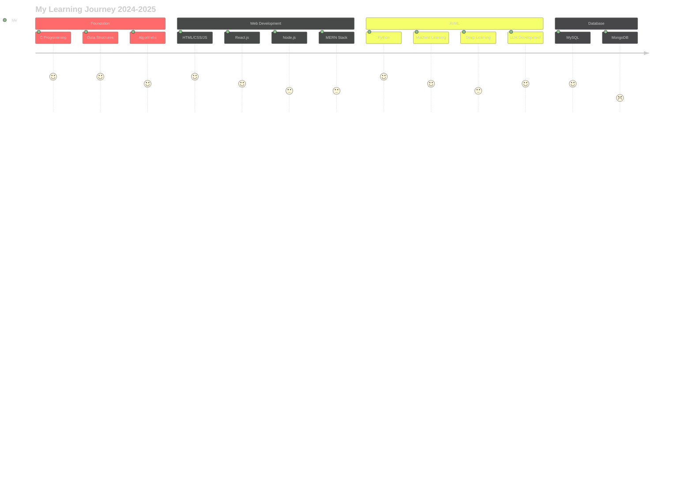
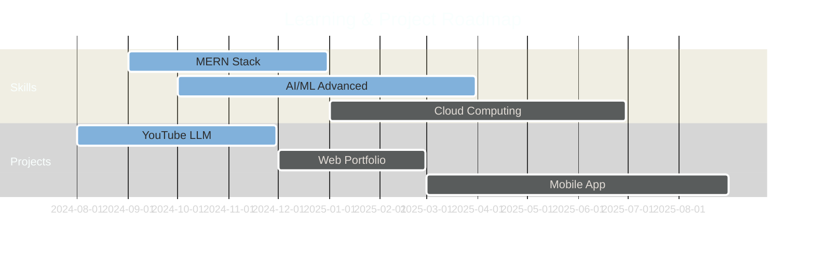

<div align="center">

# Hey there! I'm Divvyansh Kudesiaa 


<p align="center">
  
  
  
</p>

---

## 🎯 About Me


### 🎯 Current Focus
- 🤖 **Building intelligent LLM applications**
- 🌐 **Mastering full-stack web development**  
- 📊 **Exploring data science and machine learning**
- 🛠️ **Contributing to open-source projects**
- 🚀 **Creating innovative solutions**

---

## 🛠️ Tech Arsenal

<div align="center">

### 💻 Programming Languages
<p>
  
  
  
  
</p>

### 🌐 Web Technologies
<p>
  
  
  
  
  
</p>

### 🗄️ Databases & Tools
<p>
  
  
  
</p>

### 🤖 AI/ML & Frameworks
<p>
  
  
  
</p>

### 🚀 AI Platforms & Emerging Tech
<p>
  
  
  
  
  
</p>

</div>

---

## 📊 GitHub Analytics Dashboard

<div align="center">

### 🔥 Core Statistics


### 📈 Language Distribution


### 📊 Detailed Analytics


### 🎯 Commit Patterns


### 📈 Advanced Activity Graph


### 🏅 Profile Summary Card


### ⏰ Coding Time Distribution


### 📅 Commit Distribution


</div>

---

## 🏆 GitHub Achievements & Trophies

<div align="center">
  
</div>

---

## 🌟 Skills Radar Chart

<div align="center">

```mermaid
%%{init: {'theme':'dark', 'themeVariables': { 'primaryColor': '#ff6b6b', 'primaryTextColor': '#ffffff', 'primaryBorderColor': '#4ecdc4', 'lineColor': '#feca57', 'sectionBkgColor': '#0d1117', 'altSectionBkgColor': '#161b22', 'gridColor': '#30363d', 'c0': '#ff6b6b', 'c1': '#4ecdc4', 'c2': '#45b7d1', 'c3': '#96ceb4', 'c4': '#feca57', 'c5': '#ff9ff3', 'c6': '#54a0ff'}}}%%
radar
    title Skills Assessment
    "Python" : 90
    "Java" : 85
    "C/C++" : 80
    "Web Dev" : 75
    "AI/ML" : 85
    "Database" : 70
    "Problem Solving" : 95
    "DSA" : 80
```

</div>

---

## 💡 Featured Projects & Contributions

<div align="center">

### 🎥 YouTube Video Transcribe Summarizer LLM


> 🚀 An intelligent application that transcribes and summarizes YouTube videos using advanced language models

### 🌟 Upcoming Projects


</div>

---

## 🌐 Connect & Collaborate

<div align="center">

<p>
  <a href="https://www.linkedin.com/in/divvyansh-kudesiaa-3440a431b" target="_blank">
    
  </a>
  <a href="https://instagram.com/divvyanshnaakaarafr" target="_blank">
    
  </a>
  <a href="mailto:divvyanshkudesiaa1@gmail.com">
    
  </a>
  <a href="https://github.com/naakaarafr" target="_blank">
    
  </a>
</p>

### 🤝 Open for Collaborations


</div>

---

## 💭 Daily Motivation & Learning

<div align="center">
  
</div>

### 📚 Current Learning Journey
<div align="center">



</div>

---

## 🔥 Top Contributions & Repository Analytics

<div align="center">
  
</div>

### 📈 Repository Traffic & Insights
<div align="center">
  
</div>

---

## 🎯 Goals & Roadmap

<div align="center">

### 2024-2025 Objectives


</div>

---

<div align="center">


### 🚀 *"The best way to predict the future is to create it!"* - Peter Drucker


</div>

---

<div align="center">
  <sub><strong>Crafted with passion by Divvyansh Kudesiaa</strong> | <em>Innovating one colorful commit at a time</em> 🎨</sub>
</div>
